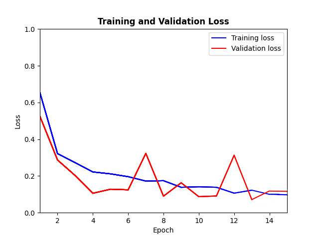
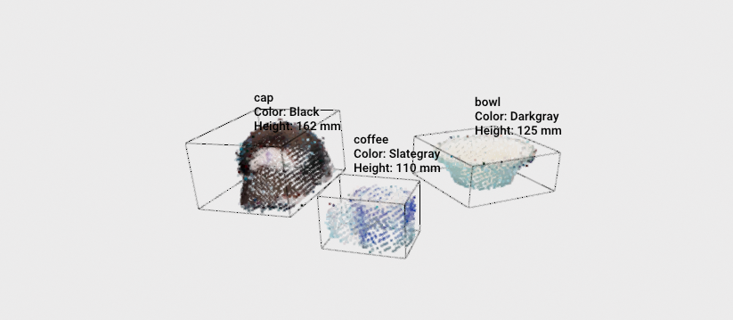

# SAVI - Trabalho Prático 2

Sistemas Avançados de Visualização Industrial (SAVI) - Grupo 3 - Universidade de Aveiro - 2023/24

## Table of Contents

* [Introduction](#introduction)
* [Datasets Used](#datasets-used)
* [Libraries Used](#libraries-used)
* [Installation](#installation)
* [Code Explanation](#code-explanation)
* [Results](#results)
* [Authors](#authors)


---
## Introduction

<p align="justify"> In this assignment, a point cloud based model was created and trained to guess objects displayed in different scenes. This program needs to pre-process the scene to retrieve each object and its properties to feed the model, narrating the object prediction and its characteristics through a text-to-speech library. Furthermore, this model was also applied to a real-time system using a RGB-D camera.</p>

---
## Datasets Used

To train the aforementioned classifier, it was used the [Washington RGB-D Object Dataset](https://rgbd-dataset.cs.washington.edu/dataset/). Therefore, it was used:
- [RGB-D Object Dataset](https://rgbd-dataset.cs.washington.edu/dataset/rgbd-dataset_pcd_ascii/) - this is a point cloud dataset of each object used to train the model;
- [RGB-D Scenes Dataset V2](https://rgbd-dataset.cs.washington.edu/dataset/rgbd-scenes-v2/) - this a point cloud dataset of each scene, where each object to test the model was retrieved.

To develop this project, a dataset splitter was used to divide the dataset files into training, validation, and testing sets. In order to prevent the model predictions from becoming biased, objects for testing were selected manually. This decision was made because, within each dataset folder, the object is the same. This division can be found in the used [Dataset Splitter](PointCloud_Learning/dataset_splitter_off.py).

---
## Libraries Used

To run the program and scripts presented in this repository, some libraries need to be installed beforehand. These are the following:

- **[Open3D](https://www.open3d.org/)**
  - Description: library that allows for rapid reading, manipulating and storing of 3D data, like point clouds.
  - Installation:
    ```bash
    pip install open3d
    ```

- **[Torch](https://pytorch.org/)**
  - Description: PyTorch, or just Torch, is a fully featured framework for building deep learning models, which is a type of machine learning that's commonly used in applications like image recognition and  processing.
  - Installation:
    ```bash
    pip3 install torch torchvision torchaudio --index-url https://download.pytorch.org/whl/cpu
    ```

- **[Torchmetrics](https://lightning.ai/docs/torchmetrics/stable/)**
  - Description: this is a convenient library that allows to compute the performance of deep learning models in an iterative fashion.
  - Installation:
    ```bash
    pip install torchmetrics
    ```
  
- **[Torch_geometric](https://pytorch-geometric.readthedocs.io/en/latest/)**
  - Description: library built upon PyTorch to easily write and train Graph Neural Networks (GNNs) for a wide range of applications related to structured data.
  - Installation:
    ```bash
    pip install torch_geometric
    ```

- **[gTTS](https://gtts.readthedocs.io/en/latest/)**
  - Description: Google Text-to-Speech (gTTS) is a library to interface with Google Translate's text-to-speech API that allows writing spoken mp3 data to a file, allowing for further audio manipulation. Adittional packages such as [LibSoX and SoX](https://packages.debian.org/sid/libsox-fmt-all) are needed to help with sound processing.
  - Installation:
    ```bash
    pip install gTTS
    ```
     ```bash
    sudo apt-get update
    ```
      ```bash
    sudo apt-get install sox
    ```
       ```bash
    sudo apt-get install libsox-fmt-all
    ```

- **[OpenNI 2](https://structure.io/openni/)**
  - Description: This is optional and only required if you want to use the real-time object detection with an RGBD camera. The camera used was an "Astra Pro NL", for different cameras this implementation may be different.
  - Installation:
    - [Download the latest version](https://structure.io/openni/)
    - [Follow this installation guide](https://astra-wiki.readthedocs.io/en/latest/installation.html#linux)

    Note: at the time of writing this, the download link in the installation guide is broken, use the one provided here instead.

<!-- Add more libraries as needed -->

---
## Installation

To ensure the program runs as intended, the steps presented below should be followed.

1. Clone the repository:
```bash
git clone https://github.com/Goncalo287/savi_t2/
```
2. Change into the project directory:
```bash
cd SAVI-TP2
```
3. Run the program:
```bash
./main.py
```

---
## Code Explanation 

<details >
<summary><b>Training the model</b></summary>

To train the model with Pointclouds information, a [PointNet](http://stanford.edu/~rqi/pointnet/) architecture was utilized. It consumes an entire point cloud, learns a spatial encoding of each point, aggregates learned encodings into features and feeds them into a classifier. One advantage of this architecture is that it learns the global representation of the input, ensuring that the results are independent of the orientation of the Pointcloud. In this network architecture, there are several shared MLPs (1D Convolutions) from which critical points are extracted using a Max Pooling function. These critical points (outputs) are fed into a classifier that predicts each object class. Additional detailed information about this architecture can be found at ["An Intuitive Introduction to Point Net"](https://medium.com/@itberrios6/introduction-to-point-net-d23f43aa87d2).

To optimize the classifier parameters, a PointNetLoss function was implemented. In this function, the [Negative Log Likelihood Loss (NLLLOSS)](https://pytorch.org/docs/stable/generated/torch.nn.NLLLoss.html) criterion was used to refine the model parameters during the training phase to improve validation results. To prevent overfitting during the training phase, the model was only saved when the validation error was minimum compared to those saved during the training process.

```python3
def pointnetloss(outputs, labels, m3x3, m64x64, alpha = 0.0001):
    criterion = torch.nn.NLLLoss()
```

</details>

<details >
<summary><b>Scene Preprocessing</b></summary>

To feed the classifier mentioned earlier, it is necessary to isolate the objects present in each scene. For this purpose, a script based on [Open3D](https://www.open3d.org/docs/release/) was developed to achieve the desired outcome for all scenes in an automated manner. Initially, the script detects the table, which consists solely of horizontal points. Subsequently, all points above the table, representing the objects, are retrieved. Finally, the points are grouped into clusters, where each cluster represents an object.

```python3
cluster_idxs = list(all_objects.cluster_dbscan(eps=0.031, min_points=70, print_progress=True))
obj_idxs = list(set(cluster_idxs))
obj_idxs.remove(-1)    # removing all other points
```

Additionally, properties of the objects are extracted, including color and height. These properties, along with the number and type of objects, are provided to the user through a text-to-speech script. Simultaneously, using [threading](https://docs.python.org/3/library/threading.html), a new window appears displaying the objects and their respective data.

</details>

<details >
<summary><b>Real Time System</b></summary>

This part of the program uses the color and depth images from a connected RGBD camera (Astra Pro NL). The depth image is obtained using `openni2` and displayed next to the color image in an `opencv` window. Here, the user can point the camera at the desired location and see the resulting images.

When happy with the current images, the user can press Enter to confirm and exit the while loop. A point cloud is generated from the images obtained using `open3d`. This point cloud is then used as a scene to detect and classify objects.

</details>

---
## Results

<!-- <p align="justify">Explain and show metrics. Show final image with objects and labels</p> -->

<details >
<summary><b>Training Parameters and Resulting Graph</b></summary>

<p align="justify">As can be observed from the graph in <b>Figure 1</b>, there is convergence in loss for both training and validation. The models were saved at the points of minimum validation loss to prevent overfitting, as mentioned earlier.</p>

<p align="justify">Before starting the training, the following parameters were considered based on several research articles:</p>

| Parameters | Value |
| :---:         |     :---:      |
| Epochs   | 15     | 
| Training Files     | 9000       | 
| Validation Files     | 3600       |
| Training Batch Size    | 32       |
| Validation Batch Size      | 64       |

<p align="justify">The best model resulting from the training was from epoch 13, with a validation accuracy of 98%. However, after some testing, it was found that the model from epoch 8 proved to be the best for classifying objects in the scenes.</p>

<p align="center">
  
</p>

<p align="center">
<b>Figure 1</b> - Training and Validation Loss Graph during 15 epochs.
</p> 

</details>

<details >
<summary><b>Global and Class Metrics</b></summary>

To evaluate the performance of the model generated, a test dataset was created with 4136 files, to be fed to the model. To assess the model's quality, [performance metrics](https://towardsdatascience.com/a-look-at-precision-recall-and-f1-score-36b5fd0dd3ec) were calculated, yielding the following values for the model from epoch 8:

| Metrics | Value |
| :---:         |     :---:      |
| Macro-Averaging Precision   | 94.6%     | 
| Macro-Averaging Recall     | 95.5%       | 
| F1 Score     | 94.9%       |
| Class "bowl" Precision    | 95.6%       |
| Class "cap" Precision      | 79.8%       |
| Class "cereal box" Precision      | 100.0%       |
| Class "coffee mug" Precision      | 100.0%      |
| Class "soda can" Precision      | 97.5%       |

The global precision was calculated using 'macro' averaging, but the user can choose between ['macro' and 'micro' averaging](https://www.educative.io/answers/what-is-the-difference-between-micro-and-macro-averaging) in the main menu. Furthermore, a [normalized confusion matrix](Results/Confusion_Matrix_Normalized_Epoch8.png) was created to help the user estimate the quality of the model in a faster manner.  

</details>

<details >
<summary><b>Scene Objects Classification</b></summary>

<p align="justify">After training the model and preprocessing the scene, each object can be passed through the model to output the predicted label. Finally, the final result can be shown in a results window, so that the user can evaluate all the information.</p>

<p align="center">
  
</p>

<p align="center">
<b>Figure 2</b> - Objects identified in the scene, predicted labels and respective properties.
</p> 

</details>

---
## Authors

These are the contributors who made this project possible:

- **[Adriano Figueiredo](https://github.com/AdrianoFF10)**
  - Information:
    - Email: adrianofigueiredo7@ua.pt
    - NMec: 104192

- **[Gonçalo Anacleto](https://github.com/Goncalo287)**
  - Information:
    - Email: goncalo.anacleto@ua.pt
    - NMec: 93394

- **[Ricardo Bastos](https://github.com/RBastos36)**
  - Information:
    - Email: r.bastos@ua.pt
    - NMec: 103983
